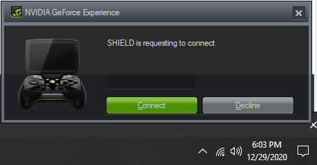

# moonlight-embedded-launcher
Docker container/Kodi launcher for running moonlight-embedded on LibreELEC/Raspberry Pi systems.

## Background:
This Docker container/Kodi addon-on was developed to enable moonlight game streaming on LibreELEC systems.  Since LibreELEC is a "just enough" distribution dependencies for moonlight-embedded are missing, requiring the use of a Docker container to run.  A simple add-on lets you launch moonlight-embedded from within Kodi and stream games from your PC to your LibreELEC devicee.
More info on moonlight-embedded can be found here:
https://github.com/irtimmer/moonlight-embedded

## Prerequisites:
- Raspberry Pi device with LibreELEC installed, connected to local network via ethernet (preferred) or wifi
- Gaming PC with Steam and Nvidia GeForce Experience installed, connected to local network via ethernet (preferred) or wifi
- Basic familiarity with ssh and terminal for installation

## Instructions:
1. Enable Nvidia Gamestream on your gaming PC
```
GeForce Experience/Settings/Shield/Gamestream (move slider to right)
```
2. Enable Avahi in LibreELEC
```
Kodi/Add-ons/LibreELEC Configuration/Services/Enable Avahi
```
3. Enable Docker in LibreELEC
```
Kodi/Add-ons/Install from repository/LibreELEC Add-ons/Services/Docker
```
4. SSH into your LibreELEC device, download/extract the latest release of this repository to your LibreELEC device and run install.sh
```sh
wget https://github.com/clarkemw/moonlight-embedded-launcher/archive/v0.2/moonlight-embedded-launcher-0.2.zip
unzip moonlight-embedded-launcher-0.2.zip
cd moonlight-embedded-launcher-0.2
bash ./install.sh
```
5. The installer script will guide you through the process. The only user interaction required is during the pairing process. The LibreELEC terminal will give you a 4 digit code, and you will see a pop-up on your gaming PC to enter the code.  
```
Searching for server...
Connect to 192.168.0.101...
Generating certificate...done
Please enter the following PIN on the target PC: 4321
```
  
6. Install the launcher add-on from the script.moonlight-embedded-launcher.zip file
```
Kodi/Add-ons/Install from zip file/Select script.moonlight-embedded-launcher.zip
```
7. Launch moonlight-embedded from within Kodi and enjoy your game streaming experience.  Exit Steam (power icon) to stop streaming/re-open Kodi.
```
Kodi/Add-ons/Game add-ons/Moonlight Embedded Launcher
```

## Troubleshooting:
TBD
